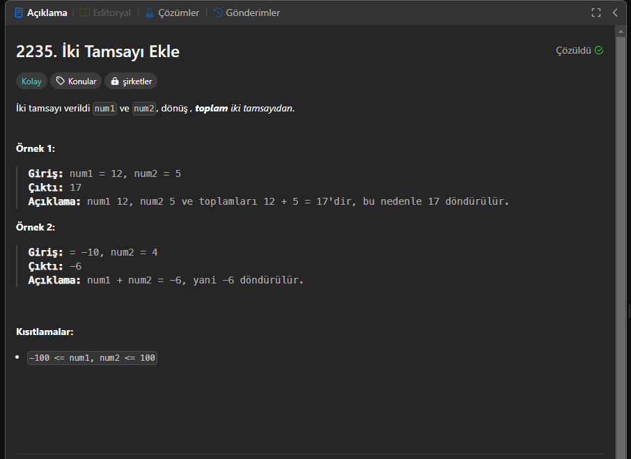

# 2235. Add Two Integers  

  

## 📝 Problem Description  
Given two integers `num1` and `num2`, return the sum of the two integers.  

### 💡 Explanation  
Bu soru bizden **iki tam sayıyı toplama işlemi yapmamızı** istiyor.  
Verilen iki tam sayıyı toplayarak **sonucu döndürmemiz** gerekiyor.  

---

## 🔍 Solution Analysis  

Bu problem **oldukça basit bir toplama işlemi** gerektiriyor.  
**Toplama operatörü (`+`) kullanarak** iki tam sayıyı toplayabiliriz.  

### ⏳ Time Complexity  
- **O(1)** → Çünkü yalnızca **basit bir toplama işlemi** yapıyoruz.  

### 🛠 Space Complexity  
- **O(1)** → **Ekstra bellek kullanılmıyor**, sadece sonuç döndürülüyor.  

---

## 💻 C# Code Implementation  
```csharp
public class Solution {
    public int Sum(int num1, int num2) {
        return num1 + num2;
    }
}
