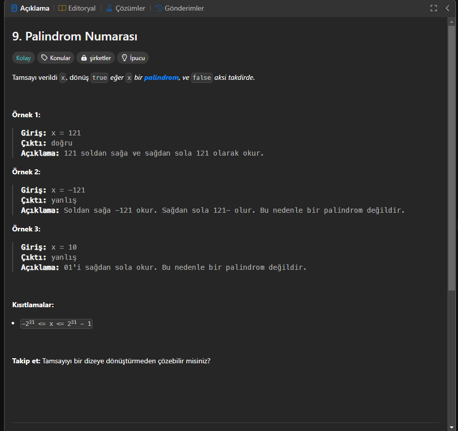

# Palindrom Sayı (LeetCode 9)  

  

## 📝 Soru Açıklaması  
Bir tam sayı veriliyor ve bu sayının **palindrom** olup olmadığını kontrol etmemiz isteniyor.  

📌 **Palindrom Nedir?**  
- Palindrom, **tersten okunduğunda da aynı olan bir sayı veya kelimedir**.  
- Örnekler:  
  - **121** → Tersten de **121**, yani palindrom. ✅  
  - **-121** → Tersten **121-**, farklı olduğu için palindrom değil. ❌  
  - **10** → Tersten **01**, farklı olduğu için palindrom değil. ❌  

## 🔍 Çözüm Yöntemi  

### ✨ Adım 1: Özel Durumları Kontrol Edelim  
- Negatif sayılar **palindrom olamaz** (`-121`, `-10` gibi).  
- Sıfır hariç, **10, 100 gibi sıfırla biten sayılar** da palindrom olamaz.  

### ✨ Adım 2: Sayının Yarısını Tersine Çevirme  
- Sayıyı **string'e çevirmeden** tersine çevirerek kontrol edelim.  
- Sayının **yarısını ters çevirip** geri kalanıyla kıyaslayalım.  

---

## 💡 C# Çözümü  
```csharp
public class Solution {
    public bool IsPalindrome(int x) {
        if (x == 0)
            return true;
        if (x < 0 || (x % 10 == 0 && x != 0)) 
            return false;

        int reverse = 0;
        while (x > reverse) {
            int lastDigit = x % 10;
            x /= 10;
            reverse = reverse * 10 + lastDigit;
        }

        return (x == reverse || x == reverse / 10);
    }
}
